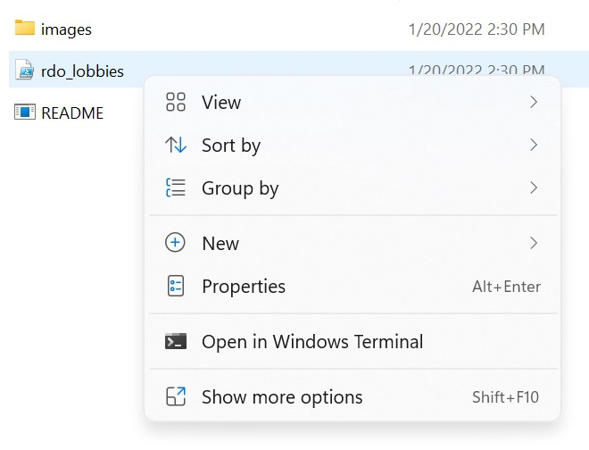
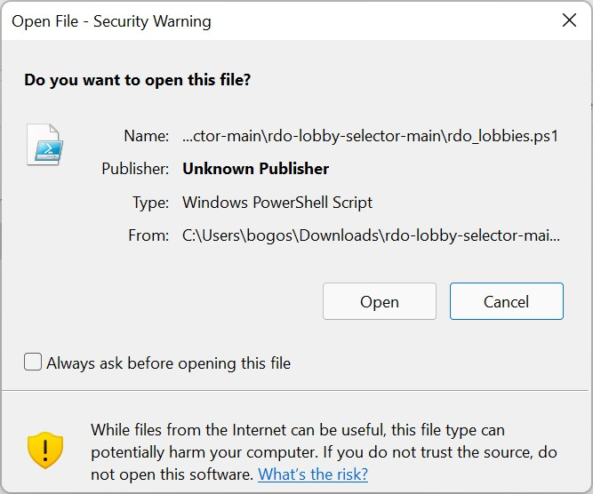
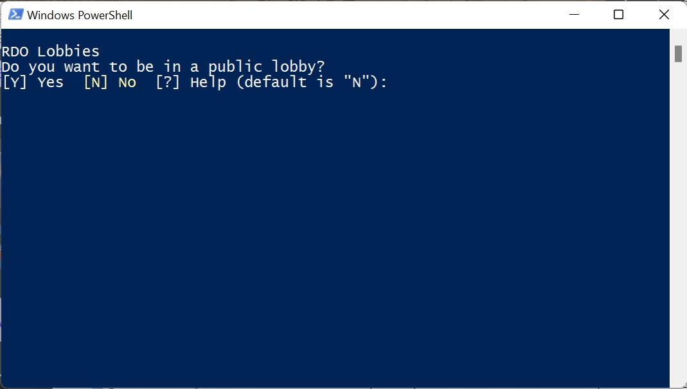

# rdo-lobby-selector

**Note:** This program makes a BIG assumption that your game is installed at C:\Program Files\Epic Games\RedDeadRedemption2. If it's not, this will not work. I welcome PRs to fix this.

First, click the green "<> Code" button above and select "Download ZIP". Right click that file and choose to extract all files to a folder.

To run the program, right click on the file named "rdo-lobby-selector.ps1" inside this folder and select "Run with PowerShell". 

**Note:** the ".ps1" will likely not be visible to you.

After clicking, you'll be prompted whether you want to run the file.

Here, you should select "Open" and uncheck checkbox to always ask for permission for this file (optional). When the program runs you'll be prompted with a Windows PowerShell window to either move back into the public lobbies, or create your own named lobby.

